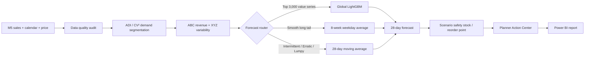

# Walmart M5 Demand Planning Analytics

End-to-end retail demand forecasting and planning workflow using Python, SQL, LightGBM, and Power BI on the public Walmart M5 dataset.

The project works at the **item × store** level and connects data validation, demand segmentation, time-based forecast evaluation, value-based model routing, planner actions, and inventory scenarios.

## Power BI report

**[Download the validated Power BI report (.pbit)](powerbi/Walmart_M5_Demand_Planning_Portfolio.pbit)**

Open the `.pbit` in Power BI Desktop. The file contains the five-page report and embedded analytical outputs; no local CSV path is required for initial review. A `.pbix` copy can be created in Power BI Desktop with **File → Save As**.

Report pages:
1. **Executive Planning Overview** — 28-day outlook, risk, state/department views, ABC-XYZ mix, and priority queue.
2. **Demand Forecast & Model Performance** — holdout WAPE, bias, rolling baseline comparison, feature importance, and weekly routed forecast.
3. **Merchandise & Assortment Planning** — revenue, units, ABC/XYZ mix, category outlook, and priority merchandise.
4. **Planner Action Center** — ranked item-store actions using value, volatility, demand movement, and risk.
5. **Scenario Planning** — lead-time, review-period, and service-level what-if analysis for safety stock, reorder point, and target stock.

## Key results

| Area | Result |
|---|---:|
| Item-store series | 30,490 |
| Observed daily records | 59.2M |
| 28-day routed forecast | 1,242,423.1 units |
| Prior 28-day units | 1,231,764 |
| Aggregate forecast growth | +0.87% |
| Priority LightGBM WAPE | **45.03%** |
| Relative WAPE improvement vs MA28 | **8.96%** |
| A-class trailing revenue share | ~80.0% |
| High-risk item-store records (risk ≥ 70) | **3,876** |
| Power BI report pages | 5 |

## Forecast routing

Demand is highly sparse, so the final router does not force one model across all 30,490 series:

1. **Top 3,000 item-store series by trailing estimated revenue** → LightGBM
2. **Remaining Smooth demand** → 8-week weekday average
3. **Remaining Intermittent / Erratic / Lumpy demand** → 28-day moving average

The same value definition is used for holdout cohort selection: weekly units × the sell price for that item-store-week, summed over the trailing pre-holdout window.

## Planning architecture



## Dataset audit

| Metric | Result |
|---|---:|
| Item-store series | 30,490 |
| Unique items | 3,049 |
| Stores | 10 |
| States | 3 |
| Categories | 3 |
| Departments | 7 |
| Observed days | 1,941 |
| Date range | 2011-01-29 to 2016-05-22 |
| Total units | 66,927,173 |
| Zero-demand observations | 68.0% |

The raw-data checks also verify no negative/missing sales, no duplicate series/calendar keys, valid positive sell prices, unique store-item-week price keys, and exact equality between the validation history and the first 1,913 days of the evaluation file.

M5 does **not** provide on-hand inventory, purchase orders, supplier lead times, or lost-sales information. Zero-sales days are therefore not treated as stockouts.

## Demand segmentation

Trailing 365-day ADI and CV² classify each series:

| Demand pattern | Series | Share |
|---|---:|---:|
| Intermittent | 23,096 | 75.7% |
| Lumpy | 3,761 | 12.3% |
| Smooth | 2,939 | 9.6% |
| Erratic | 694 | 2.3% |

ABC uses trailing estimated revenue; XYZ uses weekly demand variability.

## Forecast validation

Simple models are evaluated on three chronological 28-day folds. The ML challenger uses one leakage-safe 28-day priority holdout.

| Model | WAPE | MAE | RMSE | Bias |
|---|---:|---:|---:|---:|
| **LightGBM** | **45.03%** | **2.50** | **4.26** | **-0.67%** |
| MA28 | 49.46% | 2.74 | 4.86 | -1.28% |
| WeekdayAvg8 | 49.54% | 2.75 | 4.78 | -1.06% |
| SeasonalNaive7 | 56.77% | 3.15 | 5.43 | -6.16% |

LightGBM improves WAPE by **8.96% relative to MA28** on the priority holdout.

The ML feature set includes demand lags, rolling level/volatility, weekly sell price and price change, calendar/event/SNAP fields, and product/store hierarchy identifiers. Price histories are forward-filled only; later prices are never backfilled into earlier weeks.

## Planner Action Center

The final item-store table combines value class, volatility, demand pattern, forecast movement, planning-change signal, risk score, forecast route, scenario stock levels, and a planner action.

A **risk score ≥ 70** defines the high-risk queue. There are **3,876** such item-store records, representing **16.63%** of trailing-365-day estimated revenue.

When an MA28 route mechanically reproduces the previous 28-day total, the planning-change signal uses recent run-rate movement instead of leaving the series structurally flat.

## Scenario planning

Inventory outputs are scenarios, not observed Walmart inventory.

Default assumptions:
- lead time: 14 days
- review period: 7 days
- A / B / C service levels: 95% / 90% / 85%
- volatility lookback: trailing 90 days

Baseline totals:
- safety stock: **225,815.5 units**
- reorder point: **847,028.3 units**
- target stock: **1,157,623.9 units**

The default scenario reconciles exactly to the stored baseline. Safety stock uses a normal-volatility approximation; for intermittent and lumpy demand it is a sensitivity scenario rather than a calibrated service-level guarantee.

## Reproduce

1. Download the **M5 Forecasting - Accuracy** data.
2. Put `calendar.csv`, `sales_train_evaluation.csv`, and `sell_prices.csv` in `data/raw/`.
3. `pip install -r requirements.txt`
4. `python src/run_pipeline.py`
5. `python src/priority_model.py`
6. `python src/final_forecast.py`

Large processed tables are excluded from Git and regenerated from source. GitHub Actions independently rebuilds the analytics and validates the compiled Power BI template.

## Repository structure

```text
.
├── .github/workflows/
├── data/
├── docs/
├── outputs/
├── powerbi/
│   ├── README.md
│   └── Walmart_M5_Demand_Planning_Portfolio.pbit
├── sql/
├── src/
├── tests/
├── tools/
└── requirements.txt
```

## Stack

**Python:** pandas, NumPy, LightGBM, Numba  
**Forecasting:** rolling-origin validation, intermittent-demand benchmarks, global ML forecasting  
**Planning:** ABC-XYZ, ADI/CV², safety stock, reorder point, planner actions  
**SQL:** planner KPI and action-queue queries  
**Power BI:** semantic model, DAX, slicers, scenario controls, five-page report  
**Engineering:** reproducible scripts, tests, GitHub Actions, automated PBIT build

## Scope and limitations

This is an independent analysis of public competition data. It is not affiliated with Walmart and does not represent current Walmart operations. The dataset ends in 2016. The official M5 competition metric is WRMSSE; WAPE/MAE/RMSE/bias are used here as planner-facing diagnostics, not leaderboard-equivalent scores.
