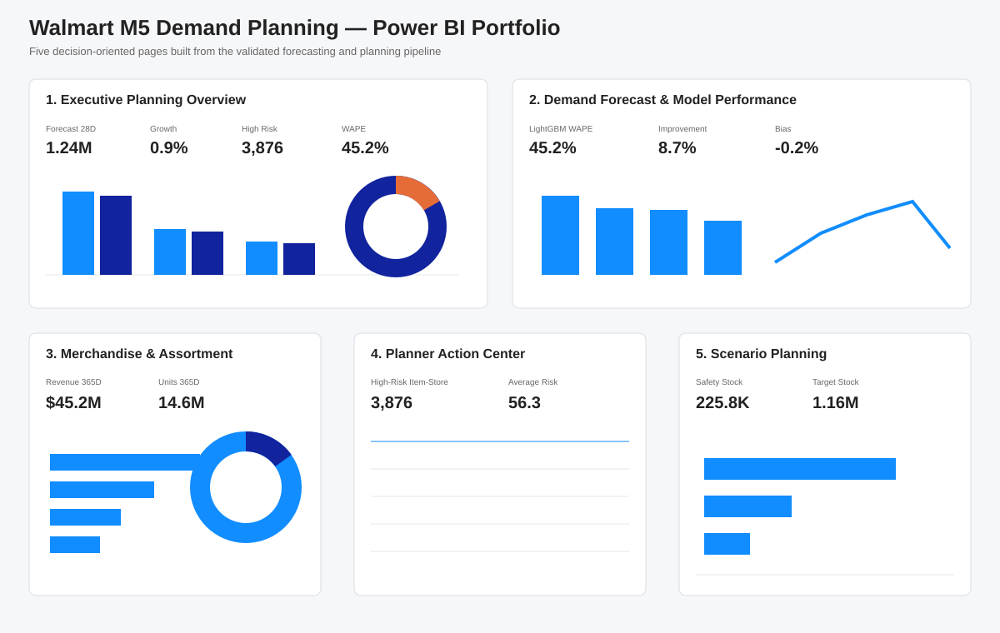
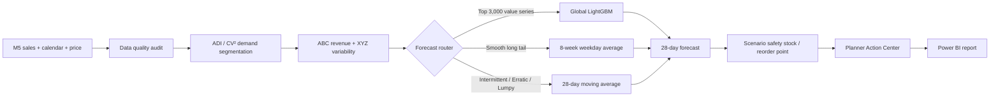

# Walmart M5 Demand Planning Analytics

**End-to-end retail demand forecasting, merchandise prioritization, replenishment scenarios, and Power BI decision support using Python, SQL, LightGBM, and the public Walmart M5 dataset.**

This portfolio project is designed as a **planning workflow**, not as a generic Kaggle notebook. It moves from raw M5 data through audit, demand segmentation, time-based forecast validation, value-aware model routing, planner actions, inventory scenarios, and a finished five-page Power BI report at the **item × store** level.

## Power BI portfolio report

The final report is available as a self-contained Power BI template:

**[Download the Power BI portfolio template](powerbi/Walmart_M5_Demand_Planning_Portfolio.pbit)**

Open the `.pbit` in Power BI Desktop, then use **Save As** if you want a local `.pbix` copy. The portfolio template contains the embedded analytical outputs required to review the report without configuring local CSV paths.

The report contains five decision-oriented pages:

1. **Executive Planning Overview** — 28-day demand outlook, risk, state/department views, ABC-XYZ mix, and priority queue.
2. **Demand Forecast & Model Performance** — model WAPE, forecast bias, rolling baseline comparison, top forecast drivers, and weekly routed forecast.
3. **Merchandise & Assortment Planning** — revenue, units, ABC/XYZ mix, category outlook, and high-priority merchandise.
4. **Planner Action Center** — ranked item-store actions using value, volatility, demand movement, and risk.
5. **Scenario Planning** — lead-time, review-period, and service-level what-if analysis for safety stock, reorder point, and target stock.



## Business questions

- What will likely sell during the next 28 days?
- Which item-store combinations deserve the most planner attention?
- Which demand patterns need different forecasting methods?
- Where is demand accelerating or declining?
- What safety-stock / reorder-point coverage would be reasonable under explicit lead-time and service-level assumptions?

## Portfolio highlights

| Area | Result |
|---|---:|
| Item-store series | 30,490 |
| Observed daily records | 59.2M |
| 28-day routed forecast | ~1.24M units |
| Priority LightGBM WAPE | **45.14%** |
| Relative WAPE improvement vs MA28 | **8.74%** |
| A-class trailing revenue share | **80.0%** |
| High-risk item-store records | **3,876** |
| Power BI report pages | **5** |

## Why this project is different

A large share of retail demand is sparse and intermittent, so forcing one forecasting model across every SKU-store combination is inefficient and often inaccurate. This project uses a **value-aware forecast router**:

1. **Top 3,000 high-value item-store series** → global LightGBM challenger
2. **Remaining Smooth demand** → 8-week weekday average
3. **Remaining Intermittent / Erratic / Lumpy demand** → 28-day moving average

The model architecture is driven by backtest evidence rather than by model complexity for its own sake.

## Planning architecture



## Dataset audit

| Metric | Result |
|---|---:|
| Item-store series | 30,490 |
| Unique items | 3,049 |
| Stores | 10 |
| States | 3 |
| Categories | 3 |
| Departments | 7 |
| Observed days | 1,941 |
| Date range | 2011-01-29 to 2016-05-22 |
| Total units | 66,927,173 |
| Zero-demand observations | 68.0% |

The public M5 data includes unit sales, weekly sell prices, calendar events, and SNAP indicators. It does **not** include Walmart on-hand inventory, purchase orders, vendor lead times, or actual replenishment decisions.

A final QA pass verified that the validation file is an exact prefix of the evaluation history for all **30,490 series × 1,913 validation days**, so the evaluation file is safely used as the canonical observed sales source.

## Demand segmentation

Each item-store series is classified over the trailing 365 days using **ADI** and **CV²**:

| Demand pattern | Series | Share |
|---|---:|---:|
| Intermittent | 23,096 | 75.7% |
| Lumpy | 3,761 | 12.3% |
| Smooth | 2,939 | 9.6% |
| Erratic | 694 | 2.3% |

The project also applies **ABC revenue segmentation** and **XYZ weekly-demand variability**, giving planners a combined value/volatility view.

## Forecast validation

All forecasting tests use time-based holdouts. Statistical challengers are evaluated across three rolling 28-day folds.

For the leakage-safe priority-series holdout:

| Model | WAPE | RMSE | Bias |
|---|---:|---:|---:|
| **LightGBM** | **45.14%** | **4.30** | **-0.86%** |
| 28-day moving average | 49.46% | 4.86 | -1.25% |
| 8-week weekday average | 49.53% | 4.78 | -1.07% |
| 7-day seasonal naive | 56.75% | 5.44 | -6.12% |

**Result:** the priority LightGBM challenger reduced WAPE by **8.74% relative to the 28-day moving-average baseline**.

The ML feature set includes recent demand lags, rolling demand level/volatility, weekly sell price, price change, weekday/month, event flags, state SNAP indicators, and product/store hierarchy identifiers.

Price preparation is leakage-safe: prices are **forward-filled only** and initial pre-launch missing values are encoded as unavailable rather than backfilled from later weeks. M5-provided future-horizon prices are used only as known planning covariates for the competition horizon.

## Planner Action Center

The final item-store output translates the forecast into business-facing fields including ABC-XYZ class, demand pattern, trailing revenue, forecast movement, planning-change signal, risk score, scenario stock levels, forecast route, and a planner action recommendation.

The **planning change signal** is deliberately separate from forecast accuracy. When an MA28 route mechanically reproduces the latest 28-day total, the action layer falls back to recent run-rate movement. A symmetric zero-baseline fallback keeps new-demand and drop-to-zero cases finite rather than silently turning them into missing values.

The final 28-day planning horizon totals about **1.24 million forecast units** versus **1.23 million units** in the prior 28 days, roughly **+0.9%** at the aggregate level. This is a planning output, not an out-of-sample accuracy claim.

## Inventory-scenario integrity

M5 does not contain observed inventory. To avoid overstating what the public data can support, inventory outputs are explicit scenarios:

- lead time: 14 days
- review period: 7 days
- A-class service level: 95%
- B-class service level: 90%
- C-class service level: 85%
- demand-volatility lookback: trailing 90 days

These calculations are decision-support outputs, **not actual Walmart stock or order quantities**.

## Final validation

Before the Power BI build, the full project was rerun from the raw M5 ZIP through audit, segmentation, rolling backtests, leakage-safe ML holdout, final model routing, planner scenarios, and Power BI-ready output generation. Code-quality checks include syntax validation and **9 regression/unit tests**.

See [`docs/validation_report.md`](docs/validation_report.md) for the three-stage QA report and the issues corrected during final review.

## Repository structure

```text
.
├── .github/workflows/
├── assets/
│   └── powerbi_dashboard_gallery.svg
├── data/README.md
├── docs/
├── outputs/
├── powerbi/
│   ├── README.md
│   └── Walmart_M5_Demand_Planning_Portfolio.pbit
├── sql/planner_kpis.sql
├── src/
├── tests/
├── tools/
├── config.yaml
└── requirements.txt
```

## Reproduce the analysis

1. Download the **M5 Forecasting - Accuracy** files from Kaggle.
2. Put `calendar.csv`, `sales_train_evaluation.csv`, and `sell_prices.csv` in `data/raw/`.
3. Install dependencies: `pip install -r requirements.txt`
4. Run the core audit / segmentation / backtest pipeline: `python src/run_pipeline.py`
5. Reproduce the leakage-safe priority-model holdout: `python src/priority_model.py`
6. Generate the final routed forecast and Power BI-ready planner tables: `python src/final_forecast.py`

The larger `data/processed/` tables are intentionally excluded from Git and can be regenerated from the public source data. The repository also includes the Power BI build tooling used to compile the portfolio `.pbit` from validated outputs.

## Tools demonstrated

**Python:** pandas, NumPy, LightGBM, Numba  
**Forecasting:** rolling-origin validation, intermittent-demand benchmarking, global ML forecasting  
**Planning:** ABC-XYZ, ADI/CV² segmentation, service-level scenarios, safety stock / reorder point  
**SQL:** planner KPI and action-queue queries  
**Power BI:** semantic model, DAX measures, interactive filters, scenario controls, executive dashboard design  
**Engineering:** reproducible scripts, regression tests, GitHub Actions, automated Power BI template build

## Notes on responsible interpretation

This is an independent portfolio analysis using public competition data. It is not affiliated with Walmart and does not represent current Walmart operations. The dataset ends in 2016; the project demonstrates analytical and planning methodology rather than current business performance.
